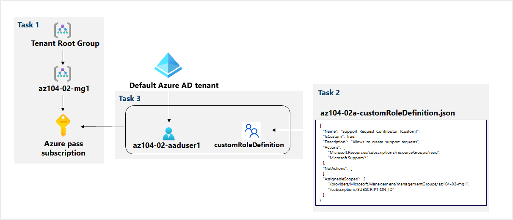

# Lab 02a - Manage Subscriptions and Role Based Access Control

*17 de Enero de 2023*

## <u>Objetivos</u>

- **Task 1**: Implementar grupos de administración.
- **Task 2**: Crear funciones de Role Based Access Control personalizadas.
- **Task 3**: Asignar funciones de Role Based Access Control.

## <u>Diagrama de arquitectura</u>

## <u>Instrucciones</u>

### TASK 1: Implementar grupos de administración.

1. Iniciamos sesión en el [**portal de Azure**](http://portal.azure.com/) .

2. Buscamos y seleccionamos **Management groups**.

3. Revisamos los mensajes en la parte superior de la página. Si vemos que el mensaje nos indica **que estamos registrados como administrador del directorio pero no tenemos los permisos necesarios para acceder al root management group** , realizaremos la siguiente secuencia de pasos:

   1. En Azure Portal, buscamos y seleccionamos **Azure Active Directory** .
   2. En la hoja que muestra las propiedades de nuestro tenant, en el menú vertical del lado izquierdo, en la sección **Manage** , seleccionamos **Properties** .
   3. En la hoja **Properties**, en la sección **Access management for Azure resources**, seleccionamos **Yes** y luego seleccione **Save** .
   4. Volvemos a la hoja de **Management groups** y después a **Refresh**.

4. En la página **Management groups** , hacemos clic en **+ Create**.

5. Lo creamos con la siguiente configuración:

   | Setting                       | Value            |
   | :---------------------------- | :--------------- |
   | Management group ID           | **az104-02-mg1** |
   | Management group display name | **az104-02-mg1** |

6. En la lista de grupos de administración, hacemos clic en el grupo de administración recién creado.

7. En **az104-02-mg1**, hacemos click **Subscriptions**.

8. En **az104-02-mg1 | Subscriptions**, clicamos en **+ Add**, en la lista desplegable seleccionamos la suscripción que estamos usando en este laboratorio y hacemos clic en **Save** .

9. En **az104-02-mg1 | Subscriptions** deberemos copiar el ID de la suscripcion ya que lo usaremos más tarde.

### TASK 2: Crear funciones de Role Based Access Control personalizadas.

1. Abrimos el fichero proporcionado por nuestro profesor:

   `{   `

   `"Name": "Support Request Contributor (Custom)",   `

   `"IsCustom": true,   `

   `"Description": "Allows to create support requests",   `

   `"Actions": [       `

      `"Microsoft.Resources/subscriptions/resourceGroups/read",       `

      `"Microsoft.Support/*"   `

   `],   `

   `"NotActions": [   `

   ` ],   `

   `"AssignableScopes": [       `

      ``"/providers/Microsoft.Management/managementGroups/az104-02-mg1",       `

      `"/subscriptions/SUBSCRIPTION_ID"   `

   `] `  

   ``}`

   Tendremos que modificar **SUBSCRIPTION_ID** por nuestra ID de suscripción.

   

2. Tendremos que subir nuestro archivo `.json` a través de nuestra **consola de Powershell de Azure**.

   

3. Una vez que subimos nuestro `.json`, creamos una **nueva definición de role** con este comando:

   `New-AzRoleDefinition -InputFile $HOME/az104-02a-customRoleDefinition.json`

   

4. Para comprobar que se nos a creado el role correctamente nos iremos a la cuenta de almacenamiento del **cloud-shell** y clicaremos en **Access control (IAM)**.

   

### TASK 3: Asignar funciones de Role Based Access Control.

1. En Azure Portal, buscamos y seleccioneamos **Azure Active Directory** , en la hoja de Azure Active Directory, hacemos clic en **Users** y luego hacemos clic en **+ New user**.

2. Crearemos un nuevo usuario con la siguiente configuración:

   | Setting                    | Value                         |
   | :------------------------- | :---------------------------- |
   | User name                  | **az104-02-aaduser1**         |
   | Name                       | **az104-02-aaduser1**         |
   | Let me create the password | enabled                       |
   | Initial password           | **Provide a secure password** |

3. Una vez que creemos el nuevo usuario copiaremos el nombre de usuario ya que más adelante lo necesitaremos.

4. En Azure Portal, volvemos a **az104-02-mg1** y hacemos click en **Access control (IAM)**.

5. Después hacemos click en + Add y después a **Add role assignment**. En la pestaña **Role**, buscamos **Support Request Contributor (RoleCustom)** .

   

6. Seleccionamos el **Role** y hacemos click en **Next**. En la pestaña **Members**, hacemos click en **+ Select members** y seleccionamos la cuenta az104-***\******\******\******\**.\******\****.onmicrosoft.com. Clickamos en **Next** and luego a **Review and assign**.

   

7. Abriremos una nueva pestaña de incógnito en el navegador e iniciaremos sesión con el último usuario que hemos creado.

8. Buscamos y seleccionamos **Resource groups** para comprobar que el usuario az104-02-aaduser1 puede ver todos los grupos de recursos.

   

9. Después buscamos y seleccionamos **All resources** para comprobar que el usuario az104-02-aaduser1 no puede ver ningún recurso.

10. En la ventana del explorador de incógnito, en Azure Portal, buscamos y seleccionamos **Help + support** y luego hacemos clic en **+ Create a support request**.

    

11. Después en la pestaña **Problem Description/Summary** de la hoja de **Help + support - New support request**, escribimos **Service and subscription limits** en el campo Summary y seleccionamos el tipo de problema **Service and subscription limits (quotas)**.

    

12. No continuaremos con la creación de la solicitud de soporte. En su lugar, cerraremos sesión como usuario az104-02-aaduser1 desde Azure Portal y cerraremos la ventana del explorador de incógnito.
